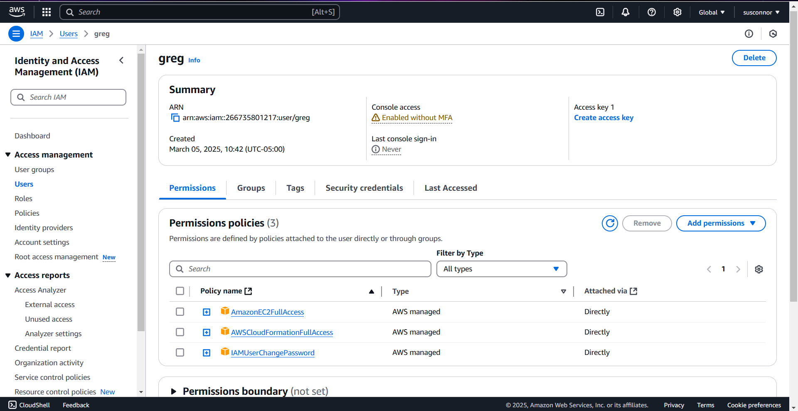
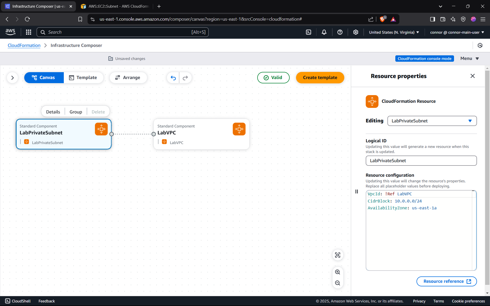
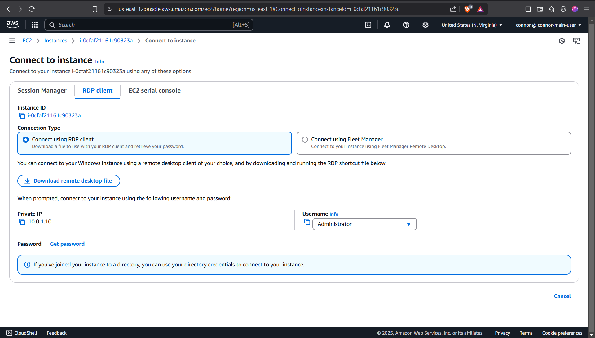

# Creating a Home Lab Using AWS CloudFormation

In this tutorial we will create a home lab environment in AWS to learn Active Directory. CloudFormation and Infrastructure Composer will be used to deploy the necessary infrastructure, which serves as a hands-on experience for understanding Infrastructure as Code (IaC) concepts. 


### AWS Command Line Interface

The AWS CLI is an open source tool that enables you to interact with AWS services using commands in your command-line shell. We will need to use this to connect to our instances later on in the lab. Download instructions for your operating system can be found [here](https://docs.aws.amazon.com/cli/latest/userguide/getting-started-install.html). Open a terminal and enter the following command:

```powershell
aws --version
```

If installed properly, you should get an output resembling:

```powershell
aws-cli/1.37.24 Python/3.12.6 Windows/11 botocore/1.36.24
```

### Create an AWS Account

[Create an AWS account](https://signin.aws.amazon.com/signup?request_type=register). This account is the root user by default. Using this account, create an IAM user with *AWSCloudFormationFullAccess* and *AmazonEC2FullAccess* permissions. This follows the principle of least privilege. For learning purposes, *PowerUserAccess* is an option, but it grants broader permissions than required.



Navigate to the security tab and create an access key for the user. The description I used is "port forwarding for home lab instances".  


AWS gives us suggestions for how to manage access keys, I would suggest using a password manager like BitWarden. 


Open your terminal again and enter the command:

```powershell
aws configure
```

Enter your keys, [default region](https://docs.aws.amazon.com/general/latest/gr/rande.html) and [output format](https://docs.aws.amazon.com/cli/latest/userguide/cli-configure-options.html). Feel free to adjust these based on your location and preference. 


### Create a VPC With Infrastructure Composer

Switch to your new IAM user account and navigate to CloudFormation. Select create a stack and choose the option to build from Infrastructure Composer. This stack is a collection of AWS resources managed as a single unit.  Deleting a stack deletes all its associated resources. 

The first resource we will add to our stack is a [Virtual Private Network](https://docs.aws.amazon.com/vpc/latest/userguide/what-is-amazon-vpc.html). A VPC provides a logically isolated section of the AWS cloud, giving you a dedicated space to launch and manage your AWS resources. This includes servers, databases, and other components you might use to create an application, or in our case, a home lab. You control the network configuration, including IP address ranges and security settings.

In the Infrastructure Composer interface, search for **VPC** on the left side and select **AWS::EC2::VPC**. Drag the VPC resource onto the canvas.

Select the VPC on the canvas and click **Details** to edit its properties.


For detailed information about VPC properties, refer to the [Resource Reference](https://docs.aws.amazon.com/AWSCloudFormation/latest/UserGuide/aws-resource-ec2-vpc.html) in the lower right corner. My suggestion is to copy the example configurations at the bottom of the documentation and adjust it based on your wants and the resource's needs. 

We will be working with YAML to define our infrastructure. Note that CloudFormation also supports JSON. Below is the VPC configurations:

```yaml
LabVPC:
    Type: AWS::EC2::VPC
    Properties:
      CidrBlock: 10.0.0.0/16
      EnableDnsSupport: true
      EnableDnsHostnames: true
```
Notice the difference between the code I just shared verses what was pasted into the **Resource configuration** section in the image above. Only the **Properties** portion of the code should be pasted into that section. 

### Subnet

Next we need a private [subnet](https://docs.aws.amazon.com/AWSCloudFormation/latest/UserGuide/aws-resource-ec2-subnet.html) where our virtual machines will live. Search **AWS::EC2::Subnet** and drag it to the canvas. Each subnet must be associated with a VPC. Below is the YAML configuration for our subnet:

```yaml
LabPrivateSubnet:
    Type: AWS::EC2::Subnet
    Properties:
      VpcId: !Ref LabVPC
      CidrBlock: 10.0.1.0/24
      AvailabilityZone: us-east-1a
      MapPublicIpOnLaunch: false
```
This is our public subnet which we need for our virtual machines to connect to the internet.

```yaml
LabPublicSubnet:
    Type: AWS::EC2::Subnet
    Properties:
      VpcId: !Ref LabVPC
      CidrBlock: 10.0.2.0/24
      AvailabilityZone: us-east-1a
      MapPublicIpOnLaunch: true
```
Usually, resources are deployed across multiple availability zones to ensure high availability. For this lab, we are using a single availability zone, which simplifies the setup while still allowing us to build and test within the cloud environment.



Now that we have multiple resources, let's take a look at the CloudFormation template that has been generated. Notice that the template reflects the complete resource structure, not just the properties section.

Be sure to validate your template after making any changes using the button in the upper right corner. Once all resources have been added, this template can be uploaded to CloudFormation at any time to quickly recreate your home lab.


### Internet & NAT Gateways

Placing our instances in a private subnet is great for security, but if we can't connect to the internet we also can't perform updates or connect to our machines using the method we have planned. 

An internet gateway enables resources in your subnets to connect to the internet if the resource has a public IP address. Similarly, resources on the internet can initiate a connection to resources in your subnet using the public IP address. Sounds great, but neither of our instances have public IP addresses. What we need is a NAT Gateway. 

The NAT Gateway translates private IP addresses of instances to its own public IP, enabling them to access the internet while preventing direct inbound connections. 

```yaml
InternetGateway:
    Type: AWS::EC2::InternetGateway

  AttachInternetGateway:
    Type: AWS::EC2::VPCGatewayAttachment
    Properties:
      VpcId: !Ref LabVPC
      InternetGatewayId: !Ref InternetGateway

  NatGatewayEIP:
    Type: AWS::EC2::EIP
    Properties:
      Domain: vpc

  NATGateway:
    Type: AWS::EC2::NatGateway
    Properties:
      SubnetId: !Ref LabPublicSubnet
      AllocationId: !GetAtt NatGatewayEIP.AllocationId
```
### Routing Tables

We need a routing table for each subnet. The public routing table directs traffic from the public subnet to the internet, while the private routing table routes traffic from the private subnet through the NAT Gateway.

The public routing table is created and associated with the public subnet. **PublicRoute** defines a route that sends all traffic to the internet gateway, allowing instances in the public subnet to communicate with the internet.

```yaml
  PublicRouteTable:
    Type: AWS::EC2::RouteTable
    Properties:
      VpcId: !Ref LabVPC

  # Public Route (Internet Access)
  PublicRoute:
    Type: AWS::EC2::Route
    Properties:
      RouteTableId: !Ref PublicRouteTable
      DestinationCidrBlock: 0.0.0.0/0
      GatewayId: !Ref InternetGateway

  PublicSubnetRouteTableAssociation:
    Type: AWS::EC2::SubnetRouteTableAssociation
    Properties:
      SubnetId: !Ref LabPublicSubnet
      RouteTableId: !Ref PublicRouteTable
```
The private routing table is created and associated with the private subnet. **PrivateRoute** directs all outbound traffic to the NAT gateway. This allows instances in the private subnet to initiate outbound internet connections through the NAT Gateway while remaining protected from direct inbound internet traffic.

```yaml
  PrivateRouteTable:
    Type: AWS::EC2::RouteTable
    Properties:
      VpcId: !Ref LabVPC

  # Private Route (Route all outbound traffic through NAT Gateway)
  PrivateRoute:
    Type: AWS::EC2::Route
    Properties:
      RouteTableId: !Ref PrivateRouteTable
      DestinationCidrBlock: 0.0.0.0/0
      NatGatewayId: !Ref NATGateway

  PrivateSubnetRouteTableAssociation:
    Type: AWS::EC2::SubnetRouteTableAssociation
    Properties:
      SubnetId: !Ref LabPrivateSubnet
      RouteTableId: !Ref PrivateRouteTable

```
### Security Groups

Next we will create [security groups](https://docs.aws.amazon.com/managedservices/latest/userguide/about-security-groups.html) for our two virtual machine. Security Groups act as virtual firewalls for resources like EC2 instances, controlling inbound and outbound traffic. They allow you to define rules based on protocols, ports, and IP addresses, specifying which traffic is permitted.


```yaml
  DCSecurityGroup:
    Type: AWS::EC2::SecurityGroup
    Properties:
      GroupDescription: Allow AD traffic, RDP, and SSM for DC
      VpcId: !Ref LabVPC
      SecurityGroupIngress:
        - IpProtocol: icmp
          FromPort: -1
          ToPort: -1
          CidrIp: 10.0.1.0/24 # Allow ICMP from private subnet
        - IpProtocol: tcp
          FromPort: 53
          ToPort: 53
          CidrIp: 10.0.1.0/24 # DNS TCP
        - IpProtocol: udp
          FromPort: 53
          ToPort: 53
          CidrIp: 10.0.1.0/24 # DNS UDP
        - IpProtocol: tcp
          FromPort: 88
          ToPort: 88
          CidrIp: 10.0.1.0/24 # Kerberos TCP
        - IpProtocol: udp
          FromPort: 88
          ToPort: 88
          CidrIp: 10.0.1.0/24 # Kerberos UDP
        - IpProtocol: tcp
          FromPort: 389
          ToPort: 389
          CidrIp: 10.0.1.0/24 # LDAP TCP
        - IpProtocol: udp
          FromPort: 389
          ToPort: 389
          CidrIp: 10.0.1.0/24 # LDAP UDP
        - IpProtocol: tcp
          FromPort: 636
          ToPort: 636
          CidrIp: 10.0.1.0/24 # LDAPS TCP
        - IpProtocol: tcp
          FromPort: 445
          ToPort: 445
          CidrIp: 10.0.1.0/24 # SMB
        - IpProtocol: tcp
          FromPort: 135
          ToPort: 135
          CidrIp: 10.0.1.0/24 # RPC
        - IpProtocol: tcp
          FromPort: 49152
          ToPort: 65535
          CidrIp: 10.0.1.0/24 # Dynamic RPC ports
        - IpProtocol: udp
          FromPort: 123
          ToPort: 123
          CidrIp: 0.0.0.0/0 # NTP
        - IpProtocol: tcp
          FromPort: 3389
          ToPort: 3389
          CidrIp: 0.0.0.0/0 # RDP, Replace with your IP address /32
      SecurityGroupEgress:
        - IpProtocol: icmp
          FromPort: -1
          ToPort: -1
          CidrIp: 10.0.1.0/24 # Allow ICMP to private subnet
        - IpProtocol: tcp
          FromPort: 443
          ToPort: 443
          CidrIp: 0.0.0.0/0 # HTTPS
        - IpProtocol: tcp
          FromPort: 53
          ToPort: 53
          CidrIp: 0.0.0.0/0 # DNS TCP
        - IpProtocol: udp
          FromPort: 53
          ToPort: 53
          CidrIp: 0.0.0.0/0 # DNS UDP

```
```yaml
  ClientSecurityGroup:
    Type: AWS::EC2::SecurityGroup
    Properties:
      GroupDescription: Allow limited traffic for clients
      VpcId: !Ref LabVPC
      SecurityGroupIngress:
        - IpProtocol: icmp
          FromPort: -1
          ToPort: -1
          CidrIp: 10.0.1.0/24 # Allow ICMP from private subnet
        - IpProtocol: tcp
          FromPort: 3389
          ToPort: 3389
          CidrIp: 0.0.0.0/0 # RDP, Replace with your IP address /32
        - IpProtocol: tcp
          FromPort: 53
          ToPort: 53
          CidrIp: 10.0.1.0/24 # DNS TCP
        - IpProtocol: udp
          FromPort: 53
          ToPort: 53
          CidrIp: 10.0.1.0/24 # DNS UDP
      SecurityGroupEgress:
        - IpProtocol: icmp
          FromPort: -1
          ToPort: -1
          CidrIp: 10.0.1.0/24 # Allow ICMP to private subnet
        - IpProtocol: tcp
          FromPort: 53
          ToPort: 53
          CidrIp: 10.0.1.0/24 # DNS TCP
        - IpProtocol: udp
          FromPort: 53
          ToPort: 53
          CidrIp: 10.0.1.0/24 # DNS UDP
        - IpProtocol: tcp
          FromPort: 88
          ToPort: 88
          CidrIp: 10.0.1.10/32 # Kerberos TCP (DC IP)
        - IpProtocol: udp
          FromPort: 88
          ToPort: 88
          CidrIp: 10.0.1.10/32 # Kerberos UDP (DC IP)
        - IpProtocol: tcp
          FromPort: 389
          ToPort: 389
          CidrIp: 10.0.1.10/32 # LDAP TCP (DC IP)
        - IpProtocol: udp
          FromPort: 389
          ToPort: 389
          CidrIp: 10.0.1.10/32 # LDAP UDP (DC IP)
        - IpProtocol: tcp
          FromPort: 636
          ToPort: 636
          CidrIp: 10.0.1.10/32 # LDAPS TCP (DC IP)
        - IpProtocol: tcp
          FromPort: 445
          ToPort: 445
          CidrIp: 10.0.1.10/32 # SMB (DC IP)
        - IpProtocol: tcp
          FromPort: 443
          ToPort: 443
          CidrIp: 0.0.0.0/0 # HTTPS
        - IpProtocol: udp
          FromPort: 123
          ToPort: 123
          CidrIp: 0.0.0.0/0 # NTP
        - IpProtocol: tcp
          FromPort: 135
          ToPort: 135
          CidrIp: 10.0.1.10/32 # RPC (DC IP)
        - IpProtocol: tcp
          FromPort: 49152
          ToPort: 65535
          CidrIp: 10.0.1.10/32 # Dynamic RPC (DC IP)
```
This is a little much, but if we are going to go through the trouble of private subnets, NAT gateways, and port forwarding (to be explained later), we might as well do this correctly and only allow necessary traffic. With that being said, since it is a lab environment you could opt to allow all traffic between the two instances to free up a lot of this code. I will not judge. 

Let's check in on our canvas. 


### Systems Manager

Had we decided to place our instances in a public subnet, we could skip this part and just use Remote Desktop Protocol (RDP) to connect to our machine's public IP address.

This IAM role will later be attached to each virtual machine. Windows Servers, along with a few other operating systems, come preinstalled with SSM agents. These agents enable secure communication between your instances and the AWS Systems Manager service. Once this secure connection is established, we'll configure port forwarding through the SSM session to enable RDP access to our Windows Server instances. This allows us to use RDP's interface while maintaining the security benefits of a private subnet.

```yaml
SSMRole:
    Type: AWS::IAM::Role
    Properties:
      RoleName: EC2SSMRole
      AssumeRolePolicyDocument:
        Version: '2012-10-17'
        Statement:
          - Effect: Allow
            Principal:
              Service:
                - ec2.amazonaws.com
            Action:
              - sts:AssumeRole
      ManagedPolicyArns:
        - arn:aws:iam::aws:policy/AmazonSSMManagedInstanceCore

  SSMInstanceProfile:
    Type: AWS::IAM::InstanceProfile
    Properties:
      InstanceProfileName: ADLabInstanceProfile
      Roles:
        - !Ref SSMRole
```

### Create a Key Pair

A key pair consists of a public key and a private key. This is a set of security credentials that you use to prove your identity when connecting to an Amazon EC2 instance. For Windows instances, the private key is required to decrypt the administrator password, which you then use to connect to your instance.

```yaml
  KeyPair:
    Type: AWS::EC2::KeyPair
    Properties:
      KeyName: HomeLabKeyPair
```
### Create EC2 Instances

This lab requires two virtual machines, a Domain Controller and a client machine. Both of these will run Windows Server 2022 Base. Ideally the client machine would be windows 10, but AWS saves that operating system for [WorkSpaces](https://docs.aws.amazon.com/workspaces/latest/adminguide/amazon-workspaces.html).  

As I'm writing this, AWS is charging six cents per hour to run each of these instances using a t3 medium. If that sounds like too much, you can run it for free using a t2 micro, but it will be painfully slow. 

```yaml
DC1:
    Type: AWS::EC2::Instance
    Properties:
      ImageId: ami-001adaa5c3ee02e10
      InstanceType: t3.medium
      SubnetId: !Ref LabPrivateSubnet
      PrivateIpAddress: 10.0.1.10
      SecurityGroupIds:
        - !Ref DCSecurityGroup
      IamInstanceProfile: !Ref SSMInstanceProfile
      KeyName: !Ref KeyPair
```
```yaml
  Client1:
    Type: AWS::EC2::Instance
    Properties:
      ImageId: ami-001adaa5c3ee02e10
      InstanceType: t3.medium
      SubnetId: !Ref LabPrivateSubnet
      SecurityGroupIds:
        - !Ref ClientSecurityGroup
      IamInstanceProfile: !Ref SSMInstanceProfile
      KeyName: !Ref KeyPair
 ```
### Create a Stack

Validate the template one more time and select **Create Template** in the top right corner. This will bring you back to CloudFormation.


Create a stack, I named mine LabStack. AWS will begin assigning resources to the stack. If everything was done correctly, you will see **CREATE_COMPLETE** in green. If there's an issue with a resource, it will say **ROLLBACK_COMPLETE** in red. In this case select Events and exam the likely root cause. 


If you haven't already saved a copy of your template locally, you can download a copy of it under the Template tab.


### AWS Systems Manager Session Manager 

Using the search bar in the top left corner, search for EC2. Once your on the EC2 overview page select **Instances** on the left side bar. You will see your two virtual machines. 


Name each instances by referencing their security group. Hit **connect**.


I would like a GUI for my server, so for that reason we will jump through a few extra hoops. If we were okay with a CLI, we could just select **Session Manager** and then **Connect**. Instead, move to the RDP client tab and take note of the default username, in our case Administrator. Select **Get password**.



Here we see the key pair we created in CloudFormation. 


Open your terminal and enter the command below:

```powershell
aws ec2 describe-key-pairs --filters Name=key-name,Values=homeLabKeyPair --query KeyPairs[*].KeyPairId --output text
```

This will output the ID of your key pair. Once you have the key pair ID, retrieve the key material by inserting the key pair ID into the following command:


```powershell
aws ssm get-parameter --name /ec2/keypair/key-07a9fb1d7f267109f --with-decryption --query Parameter.Value --output text > new-key-pair.pem
```
This will fetch the private key material and save it to a .pem file named new-key-pair.pem. You can view the material with the cat command. 

```powershell
cat new-key-pair.pem
```


Paste the contents of the file in the spaces below and select **decrypt**. The password for this instance will appear on the screen. 


Open your terminal again and enter the command below, replacing <INSTANCE ID> with the instance ID of your instance. You will also need to choose two different local port numbers. I will be using 50000 and 50001. 

```powershell
aws ssm start-session --target <INSTANCE ID> --document-name "AWS-StartPortForwardingSession" --parameters "portNumber=3389,localPortNumber=50000" --region us-east-1
```

Open Remote Desktop Connection and enter the port number, username (Administrator), and password. 


Finally, we are able to use our virtual machine.


Before we wrap up this tutorial, I would like to mention an alternative solution to connecting to our instances. 

### Fleet Manager
Using the search bar, type in and select [Fleet Manager](https://docs.aws.amazon.com/systems-manager/latest/userguide/fleet-manager.html). This is a tool within AWS Systems Manager that provides a web-based GUI for managing EC2 instances without requiring port forwarding or SSH. Another advantage is that you can see and manage multiple instances on the same screen, making it easier to oversee your environment.

Check both of your virtual machines and hit **Connect with Remote Desktop**.


Here you can either log in with your username and password or enter the key pair content.


Now you can flip between both virtual machines in this browser.


You can view my tutorial on how to configure Active Directory using your new home lab [here](https://github.com/susconnor/Active-Directory-Domain-Services-Tutorial).